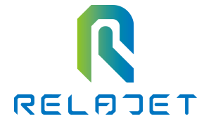

# IoT 語音情境應用

作為台灣最大的興趣社群平台，**PIXNET**累積的8.1億篇部落格文章每日提供給使用者豐富多元的生活資訊，透過瀏覽器與智慧裝置，**PIXNET**的優質內容成為最便捷的服務，早已落實在我們的日常生活中。而在物聯網技術革新的進程中，嶄新的應用將會出現。IoT裝置與內容的整合，令人拭目以待。

第五屆 PIXNET HACKATHON 以「IoT 語音情境應用」為主題，**智慧旅遊**為方向，**PIXNET**邀請各界高手從資料中發掘問題，設計創新的解決方案，讓更多元的應用情境成為可能。

## Voice Kit

Voice Kit 是由 Google 所開發，AIY project 的子項目，硬體主要為一組 **Raspberry Pi 3 model B+** 與一張音效驅動擴充板(Voice HAT)，整合了簡易的周邊如喇叭、麥克風與 GPIO，在基礎的應用中，可搭配 Google Cloud 的語音識別服務，方便開發者更快地上手，詳細的資訊可以參考[官方網站](https://aiyprojects.withgoogle.com/voice-v1/)或是這篇[介紹文](https://makerpro.cc/2018/05/google-aiy-for-maker/)。

本次 PIXNET HACKATHON 提供給參賽者的套件為 **Voice Kit 1.0** 版本[註1]，預計在 **7月第四週** 提供給報名錄取的參賽隊伍[註2]，除了使用PIXNET提供的開發套件，參賽者也可以選擇使用或整合自己的軟/硬體裝置。

* ℹ️註1: Google 官方目前主打的是最新版的 **Voice Kit 2.0**，然而硬體性能考量，主辦方將提供的是舊版的 Voice Kit 1.0 版本，幫助參賽者更容易上手。
* ️ℹ️註2: 參賽隊伍須繳交新台幣 **1500** 元保證金方可領取一組 Voice Kit 開發套件，保證金將於 **8/19** 完賽時，全額退回給現場的參賽者，Voice Kit 不用還給主辦方。

## 語音識別

由**台灣人工智慧實驗室**提供的**中文**語音識別 API 服務，免費提供給參賽者使用。
報名錄取的隊伍會提供一組專屬的 API Token，請妥善保管。
API規格請參考[說明文件](../opendata/ailabstw.md)。

## Caffe on Raspberry

⚠️準備中

## 開放資料

### PIXNET
* 熱門文章資料集：含有原始 html 的熱門文章資料，並紀錄了如標題、標籤、分類、回應與 Google 關聯的搜尋關鍵字，詳細說明請參考[PIXNET熱門文章集說明文件](../opendata/pixnet.md)。

### 台北市政府
⚠️準備中

### 新北市政府
⚠️準備中

### 亞旭電腦股份有限公司
⚠️準備中

### 其他 OpenData
在取得授權的前提下，參賽者可以使用其他的開放資料來設計自己的應用，如各縣市政府的開放資料平台：
[政府資料開放平台](https://data.gov.tw/)

## 評分標準

每組參賽隊伍針對其作品透過**簡報**(3 min)與**Live Demo**(4 min)，說明作品設計理念與適用情境。

### Live Demo 📹

主辦方將提供若干場景與道具，方便參賽者能模擬使用情境，參賽者也能自備相關道具與其他有創意的表達方式。
讓各組能表現出再怎麼樣的人事時地物下適合使用這個作品。

本競賽項目提供三個獎項，評選標準如下:

### 🏆 評審獎

* 實用性 40%
	* 服務是否易於操作
	* 設計是否貼近生活需求
* 創新度 30%
	* 能夠發掘新的想法或方法
	* 潛在的服務或應用
* 完成度 30%
	* 技術整合程度
	* 說明與演示的流暢度

### 🏆 痞客邦應用獎
* 痞客邦相關度 30%
	* 是否運用了痞客邦資料
	* 是否易於與痞客邦服務整合
* 實用性 30%
* 創新度 20%
* 完成度 20%

### 🏆 雙北綠色運具應用獎 🍀
參賽隊伍以 IoT 語音情境應用為基礎，參考但不限使用雙北市政府提供的資料，設計出符合「利用綠色運具整合旅行時間及旅運成本」之主題作品，除了簡報理念說明，並於賽事現場Demo應用情境。

ℹ️ 本賽事中綠色運具之定義包含公車、捷運、腳踏車、步行

* 實用性 15%
* 創新度 15%
* 完成度 20%
* 綠運具導入比例 20%
* 旅行成本考慮之完整性 30%
	* 如時間成本、金錢成本、轉乘次數等。

